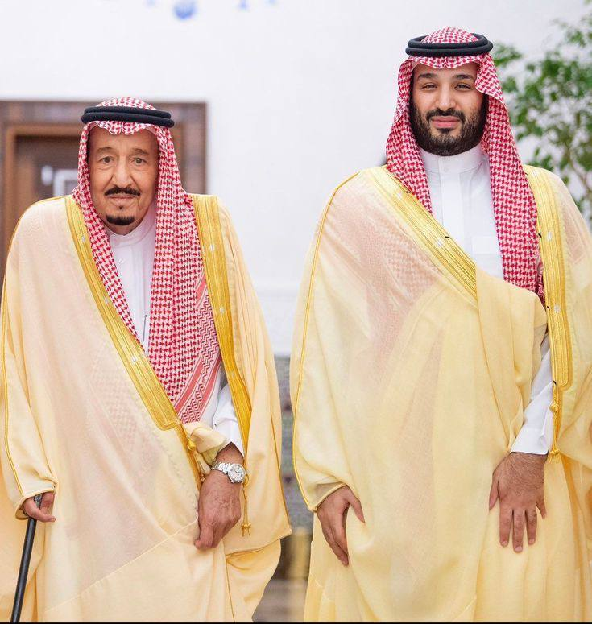
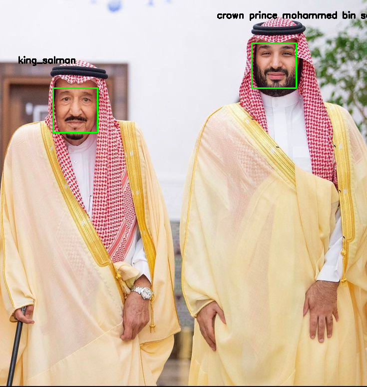

#  Face Recognition Project – Saudi Royals 
This project uses Python and the powerful `face_recognition` library to perform face detection and recognition of two prominent figures:  nd the powerful `face_recognition` librand Face Recognition Project – Saudi Roy
It is a computer vision project that applies machine learning models to identify and label these two individuals in images.  

##  Project Objective
The main objective of this project is:
- To implement a simple and efficientown Prince Mohammed bin Salma
- To recognizenition Project – Saudi Royals (King Salman and the Crown Prince) in a given photo.
- Toroject uses Python and the powerwith a box and label.
- To gain practical experience using Python libraries
  
#  Features
 1. High Accuracy Face Recognition
  Utilizes advanced face recognition algorithms to accurately detect and identify faces.
 matches unknown faces in an image with known reference faces using face encodings.
 2. Multi-Face Detection
 Capable of detecting and recognizing multiple faces in a single image.
 Automatically labels each recognized face with the correct name (“King Salman”).
3. Visual Output with Labels
  Outputs the result as an image with rectangles around recognized faces and name labels.

 # How to Use – Face Recognition of Saudi Royals 
 1. Set Up the Environment
Install Anaconda (https://www.anaconda.com/) and create a new clean environment with Python 3.10.11 to ensure compatibility with all required libraries.
 2. Install Required Libraries
Inside your new environment, install the following libraries using pip:
pip install face_recognition opencv-python numpy
 3. Prepare the Image Data
 • Inside the known_faces/ folder, place clear images of:
 • king_salman.jpg
 • mohammed_bin_salman.jpg
 • In the test_images/ folder, add the group photo or any image where you want to detect and recognize their faces.
 4. Set Up Your IDE (Optional but Recommended)
 • Open the project folder in Visual Studio Code (VSCode).
 • From the Command Palette (Ctrl + Shift + P), select your conda environment as the Python interpreter.
 5. Run the Recognition Script
Execute the main script by running:
python face_recognition_script.py

# How It Works
 1. The program loads known faces from the known_faces/ folder.
 2. It encodes those images using face_recognition to get facial features.
 3. It loads a test image from test_images/ and searches for faces in it.
 4. For each face found, it compares it to the known encodings.
 5. If a match is found, it draws a rectangle and labels the face.
 6. The result is saved to the output/ folder.

# original image

# output image 

